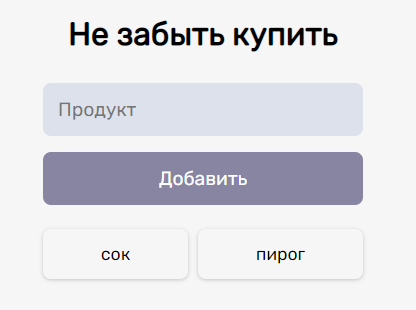

# Shopping list reminder

### Aim 
Is to get general understanding of the Firebase principles

### Used frameworks
1. HTML
2. CSS
3. JS
4. Firebase

### Result
Web application allows to add new items in list with further removal by double clicking on the spefic item.

### NB - Firebase settings
appSettings has the following type, according to firebase:

> const appSettings = {
> apiKey: "<>",
> authDomain: "<>",
> databaseURL: "<>",
> projectId: "<>",
> storageBucket: "<>",
> messagingSenderId: "<>",
> appId: "<>"
>}
